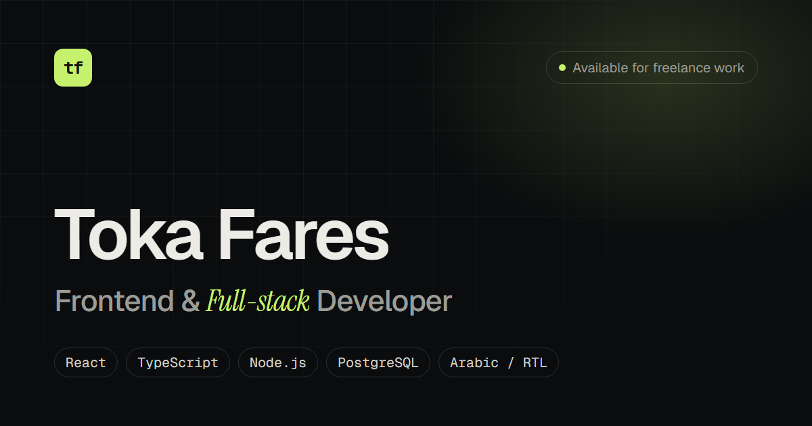

# Toka Fares: developer portfolio

Personal portfolio of a freelance frontend and full-stack developer: services, selected projects with case studies, skills, process and contact. English by default, with a full Arabic (RTL) version.

**[Live site](https://tokafares.vercel.app)**



## Features

- **Bilingual, with real RTL.** English and Arabic, toggled from the header and remembered in `localStorage`. The saved language, direction and theme are applied by an inline script before the first paint. Layout uses logical properties only (`ms/me`, `ps/pe`, `start/end`), directional icons flip in RTL, and Arabic uses Cairo with Arabic-Indic digits.
- **Typed translations.** All copy lives in `src/i18n/en.ts` and `src/i18n/ar.ts`, both typed against one `Translations` interface, so a missing string is a compile error. Arabic self-descriptions use first-person verbs and noun phrases, so the copy stays gender-neutral.
- **Case-study pages** (`/projects/:slug`): overview, technical highlights, key features, tech stack and a screenshot gallery with an accessible lightbox (focus trap, Escape to close, arrow keys that follow reading direction, swipe on touch, focus returned to the thumbnail).
- **Contact without a backend.** Direct links from the profile config, plus a validated form that opens a pre-filled email (`mailto:`) in the visitor's mail app.
- **Dark by default**, with a light theme toggle.
- **Honest by design.** No testimonials, client logos or invented numbers. Concept projects are labelled as such.
- **Accessibility.** Skip link, `:focus-visible` rings for keyboard users only, labelled controls, `aria-live` feedback, and `prefers-reduced-motion` support for every animation.

## SEO and performance

- Page-specific titles, descriptions, canonical URLs and Open Graph / Twitter tags, updated on navigation.
- `scripts/postbuild.ts` writes a static `dist/projects/<slug>/index.html` for each case study with its own metadata, so crawlers and link previews don't need JavaScript. It also writes `sitemap.xml` and `robots.txt`.
- Self-hosted variable fonts (Geist, Geist Mono, Instrument Serif). Cairo is a separate chunk loaded only when Arabic is shown.
- Screenshots are WebP in two sizes (full and 640px) with `srcset`, explicit dimensions and lazy loading. The case-study route is code-split.
- Lighthouse (local production build): 100 for accessibility, best practices and SEO; performance 100 on desktop and 93–94 on mobile.

## Tech stack

React 19 · TypeScript (strict, `noUncheckedIndexedAccess`) · Vite · Tailwind CSS v4 · React Router · lucide-react

## Personal details

Everything personal lives in **`src/data/profile.ts`**, with a `TODO` comment on each value. Leave a value empty to hide it: empty or invalid links are filtered out automatically (profile URLs must be `https://` links on the matching site). Setting `email` also turns on the contact form.

The public URL is set in `src/data/site.ts` and is used for canonical links, social tags and the sitemap.

## Project structure

```
src/
  components/   Header, Footer, ProjectCard, Lightbox, Screenshot, Reveal, icons…
  sections/     Hero, Services, Work, Skills, Process, Contact
  pages/        HomePage, ProjectPage (case study), NotFoundPage
  data/         profile.ts (your details), projects.ts, skills.ts, services.ts, site.ts, screenshots.gen.ts
  i18n/         en.ts, ar.ts, types.ts, LanguageProvider
  theme/        ThemeProvider (dark / light)
  hooks/        useDocumentMeta, useInView, useActiveSection, overlay helpers
  lib/          contact links and mailto builder, name helpers, class recipes
scripts/
  optimize-images.mjs   screenshots-src/*.png → public/screenshots/*.webp + size manifest
  postbuild.ts          static case-study HTML, sitemap.xml, robots.txt
screenshots-src/        original PNG screenshots of each project
```

## Getting started

```bash
npm install
npm run dev        # http://localhost:5173
npm run typecheck  # tsc -b
npm run build      # type-check, production build, postbuild (sitemap + static project pages)
npm run preview
```

To add or replace screenshots, put PNGs in `screenshots-src/<project-slug>/` and run `npm run images`.

## Deploying

The repo is connected to Vercel, so pushes to `master` deploy to production. `vercel.json` sets the Vite preset, an SPA rewrite (static assets and the generated project pages are served first), clean URLs and cache headers.
